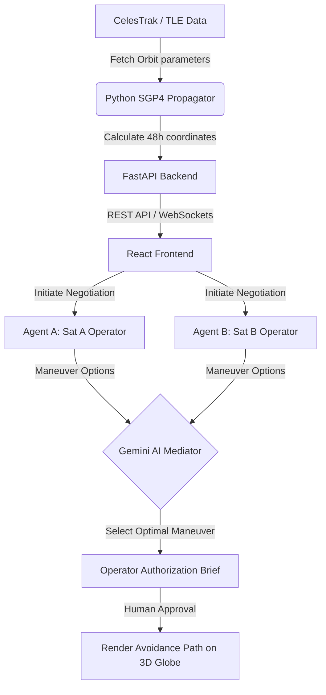

# 🛰️ DebrisMind: Autonomous Orbital Traffic Control & Collision Avoidance

DebrisMind is a cutting-edge, autonomous orbital traffic control dashboard designed to monitor satellite fleets, detect conjunction threats in real-time, and orchestrate automated collision avoidance maneuvers. 

Using **SGP4 orbital mechanics** for precise physical propagation and **Google Gemini-powered Multi-Agent Systems** for tactical collision negotiations, DebrisMind replicates the decision-making workflows of aerospace operators in a sleek, luxury-style sci-fi command console.

---

## 🌌 Key Features

- **Real-Time 3D Telemetry Visualizer:** An interactive WebGL globe rendered in Three.js featuring rotatable ECI orbits, satellite coordinate mapping, dynamic starfields, and real-time path updates for avoidance maneuvers.
- **High-Fidelity Physics Engine:** Incorporates SGP4 orbital mechanics to calculate positions and velocities directly from NORAD Two-Line Element (TLE) datasets.
- **Autonomous Multi-Agent Negotiation:**
  - **Agent A (Satellite A AI Operator):** Evaluates fuel footprint, priority, and proposes avoidance vectors (Prograde, Retrograde, Radial, etc.).
  - **Agent B (Satellite B AI Operator):** Evaluates local mission status and submits alternative options.
  - **AI Mediator:** Analyzes all 9 combinations of proposed burns and makes an optimal, fuel-conscious selection to resolve the threat.
- **Operator Authorization Console:** Command-line style telemetry terminal displaying live agent reasoning, complete with a CRT scanline visual filter, and detailed briefing cards for final human-in-the-loop authorization.
- **Multiple Operational Scenarios:**
  - **Active vs. Active:** Two controllable satellites coordinate to share the fuel/maneuver burden.
  - **Active vs. Debris:** A single active satellite executes avoidance maneuvers around unguided debris.
  - **Low-Fuel Rescue:** A cooperative rescue where a fuel-rich satellite executes the maneuver on behalf of a low-fuel neighbor.

---

## 🛠️ Architecture & Data Flow



---

## 💻 Tech Stack

### Backend
- **FastAPI / Uvicorn:** Async REST API and real-time WebSockets.
- **SGP4 Library:** High-precision orbital propagation.
- **Google Generative AI SDK (Gemini):** Core LLM engine driving multi-agent negotiation.
- **Cache Management:** Fast internal caching to prevent CelesTrak rate-limiting.

### Frontend
- **React / Vite / TypeScript:** Fast, modern frontend.
- **Three.js:** WebGL-based rendering for the 3D Earth, orbits, and local starfield.
- **OGL & React Bits:** GPU-accelerated WebGL Galaxy shader backdrop with interactive mouse repulsion.
- **TailwindCSS & Vanilla CSS:** Custom high-fidelity design system utilizing luxury editorial serif styling mixed with retro CRT HUD layouts.
- **Lucide Icons & Canvas Confetti:** Sleek utility iconography and completion micro-animations.

---

## 🚀 Getting Started

### Prerequisites
- **Python 3.10+**
- **Node.js 18+**
- **Google Gemini API Key** (Get one from Google AI Studio)

---

### Backend Setup

1. Navigate to the backend directory:
   ```bash
   cd backend
   ```
2. Create and activate a virtual environment:
   ```bash
   python -m venv .venv
   # Windows
   .venv\Scripts\activate
   # macOS/Linux
   source .venv/bin/activate
   ```
3. Install dependencies:
   ```bash
   pip install -r requirements.txt
   ```
4. Create a `.env` file in the `backend/` directory:
   ```env
   GEMINI_API_KEY=your_gemini_api_key_here
   PORT=8000
   ```
5. Launch the FastAPI server:
   ```bash
   uvicorn main:app --reload
   ```
   The backend will be running at `http://127.0.0.1:8000`.

---

### Frontend Setup

1. Navigate to the frontend directory:
   ```bash
   cd ../frontend
   ```
2. Install dependencies:
   ```bash
   npm install
   ```
3. Create a `.env` file in the `frontend/` directory (optional for local dev, defaults to localhost):
   ```env
   VITE_API_BASE=http://127.0.0.1:8000
   ```
4. Start the Vite development server:
   ```bash
   npm run dev
   ```
   Open your browser and navigate to `http://localhost:5173`.

---

## 🛰️ Deployment Notes

### Backend (Render / Docker)
- Deploy using Render Web Services or similar container hosting platforms.
- Ensure the `GEMINI_API_KEY` is configured in the production Environment Variables.
- Due to strict TLE format parsers on production servers, DebrisMind utilizes precise column-aligned templates for on-the-fly SGP4 calculation.

### Frontend (Vercel)
- Deploy the `frontend/` folder directly to Vercel.
- Configure `VITE_API_BASE` pointing to your deployed backend URL.

---

## 📝 License
This project is open-source under the MIT License.
